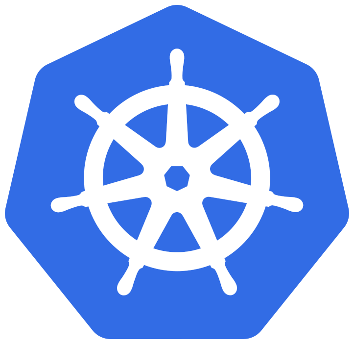

<h1 align="center">Hi 👋, I'm Asad Hussain</h1>
<h3 align="center">Backend Developer | Team Player </h3>

    &nbsp&nbsp
    

<!-- 

    <a href="https://www.linkedin.com/in/asad-hussain-b5b381116/">
        <b>LinkedIn</b>
    </a>
    ❅
    <a href="https://stackoverflow.com/users/5889270/asad-hussain">
        <b>StackOverflow</b>
    </a>
    ❅

 -->

<!-- 

    
    

 -->

- 🌱 I’m Currently Working on  **MicroServices architecture using Golang**

- 💬 Ask Me About **Golang, Microservices, Distributed Systems, Kubernetes, Python, RDBMS, REST, WebSockets**

- 📫 How To Reach Me **asadhussain9711@gmail.com**

<h1 align="center"></h1>

<h2 align="center">💻 Tech Stack</h2>

    
    

    

    
    

    
    
    

    
    
    

    
    

    
    
    

    
    

    
    

<h1 align="center"></h1>

    

    
    <!--  -->
    <!--  -->

<h1 align="center"></h1>